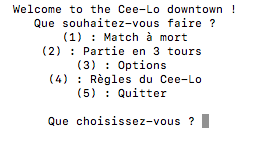

## Project overview

This is a Python reproduction of the dice game Cee-lo.

## How to make it work

Go in the folder you just clone and run `python3 main.py`. The game launches in the terminal.

## How to play

The rules of Cee-Lo are explained here : https://en.wikipedia.org/wiki/Cee-lo

## Options

`Set yout player name`: You can write your name who will be displayed in your next games.

`Set the number of players` : You can select the number of players for yout next games.

`Set the initial cash amount` : Simulate a Cee-lo game between rich aristocrats by increasing the initial cash amount of the game

`Set the number of rounds` : You can control the game's duration by selecting the number of rounds the game will last.  

